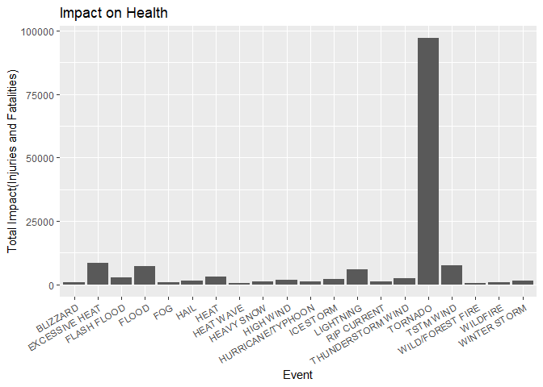
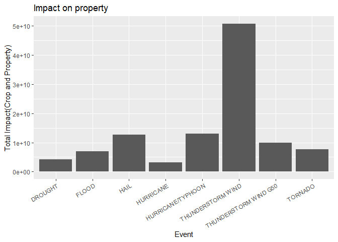

#Storm Data Analysis to segregate main contributors to damages caused.  
##Synopsis  
Storms and other severe weather events can cause both public health and economic problems for communities and municipalities. Many severe events can result in fatalities, injuries, and property damage, and preventing such outcomes to the extent possible is a key concern.

This project involves exploring the U.S. National Oceanic and Atmospheric Administration's (NOAA) storm database. This database tracks characteristics of major storms and weather events in the United States, including when and where they occur, as well as estimates of any fatalities, injuries, and property damage.

The Analysis is done in R programming and the document created using knitr. The values are weighed against each competing counterparts to analyze which event contributes most to the damages caused in order to take a targeted and planned precaution accordingly.
##Data Processing  
The given raw data contains types of events that are represented in various ways. Hence to narrow it down enough for the analysis, the character case has been converted to a unified uppercase. The events also also sometimes duplicated with only a difference like eg: (TORNADOS , TORNADO), therefore the trailing S has been removed as also leading and trailing white spaces. 

```r
library(dplyr)
```

```
## 
## Attaching package: 'dplyr'
```

```
## The following objects are masked from 'package:stats':
## 
##     filter, lag
```

```
## The following objects are masked from 'package:base':
## 
##     intersect, setdiff, setequal, union
```

```r
library(stringr)
library(ggplot2)
```

```
## Warning: package 'ggplot2' was built under R version 4.0.2
```

```r
storm_data <- read.csv("Storm_DA/repdata_data_StormData.csv.bz2",na.strings = c('',' ',NA,'?')) %>%  mutate_all(.funs=toupper)
storm_data$EVTYPE <-   str_replace(storm_data$EVTYPE,'S$','') %>% str_trim()
```

In the first analysis, we required FATALITIES and INJURIES hence we convert the 2 columns into usable forms i.e numeric.
Similarly the second analysis in the economic impact which are CROP DAMAGE and PROPERTY DAMAGE accordingly.


```r
storm_data$INJURIES <- as.numeric(storm_data$INJURIES)
storm_data$FATALITIES <- as.numeric(storm_data$FATALITIES)
storm_data$CROPDMG <- as.numeric(storm_data$CROPDMG)
storm_data$PROPDMG <- as.numeric(storm_data$PROPDMG)
```

In order to analyze the economic impacts, we need the consider 2 variables such as PROPERTY DAMAGE and CROP DAMAGE. These two variables are split into 2 columns such as magnitude and exponent. Hence we need to process the variables in order to be available for calculation:

```r
storm_data$CROPDMGEXP <- storm_data$CROPDMGEXP %>% str_replace_all("K","3")  %>%
  str_replace_all("M","6") %>%
  str_replace_all("B","9")
storm_data$CROPDMGEXP <- as.numeric(storm_data$CROPDMGEXP)
storm_data$CROPDMGEXP <- 10^storm_data$CROPDMGEXP
storm_data$CROPDMG <- as.numeric(storm_data$CROPDMG)

storm_data$PROPDMGEXP <- storm_data$PROPDMGEXP %>% str_replace_all("H","10")  %>%
  str_replace_all("\\-","-1") %>%
  str_replace_all("\\+","1") %>%
  str_replace_all("K","3")  %>%
  str_replace_all("M","6") %>%
  str_replace_all("B","9")
storm_data$PROPDMGEXP <- as.numeric(storm_data$PROPDMGEXP)
storm_data$PROPDMGEXP <- 10^storm_data$PROPDMGEXP
storm_data$PROPDMG <- as.numeric(storm_data$PROPDMG)
```

The Total and exponential values are combined in orde to get the final value:  

```r
storm_data$cropdmgtot <- storm_data$CROPDMG + storm_data$CROPDMGEXP
storm_data$propdmgtot <- storm_data$PROPDMG + storm_data$PROPDMGEXP
```
  
The total data in grouped according to event type(EVTYPE) in order to get the total of the event wise impact on the human health factor  

```r
storm_data <- storm_data  %>%
  group_by(EVTYPE) %>%
  summarise(total_injury = sum(INJURIES,na.rm = T), total_fatality = sum(FATALITIES,na.rm = T),
            total_cropdmg = sum(cropdmgtot,na.rm = T), total_propdmg = sum(propdmgtot,na.rm = T))
```

```
## `summarise()` ungrouping output (override with `.groups` argument)
```

```r
head(storm_data)
```

```
## # A tibble: 6 x 5
##   EVTYPE               total_injury total_fatality total_cropdmg total_propdmg
##   <chr>                       <dbl>          <dbl>         <dbl>         <dbl>
## 1 ABNORMAL WARMTH                 0              0            0              0
## 2 ABNORMALLY DRY                  0              0            0              0
## 3 ABNORMALLY WET                  0              0            0              0
## 4 ACCUMULATED SNOWFALL            0              0            0              0
## 5 AGRICULTURAL FREEZE             0              0      3000029.             0
## 6 APACHE COUNTY                   0              0            0           1005
```
##Results  

###Analysis of Health impact caused.  
The total impact of the health effects are calculated by adding the total event wise fatalities and injuries 


```r
storm_data$total_impact_health <- storm_data$total_injury + storm_data$total_fatality
```

Maximum impact of the event is:

```r
max_health_effect <- storm_data$total_impact_health == max(storm_data$total_impact_health)
storm_data[max_health_effect,"EVTYPE"] %>% print
```

```
## # A tibble: 1 x 1
##   EVTYPE 
##   <chr>  
## 1 TORNADO
```

The relative impact with respect to events has been depicted in the following plot. Since the total events are beyond what can be depicted in a single plot. From the entire data a few top scorers have been picked based on a significant lower limit. This does not depict that these are only the events that cause an impact, rather these are the top players among 800+ events and the health impacts caused by them.


```r
significant_impact <- storm_data$total_impact_health >= 500.0
g <- ggplot(storm_data[significant_impact,], aes(x = EVTYPE, y = total_impact_health)) +
  geom_bar(stat = "identity") +
  labs(title = "Impact on Health", x = "Event", y = "Total Impact(Injuries and Fatalities)") +
  theme(axis.text.x = element_text(angle = 30, hjust=1))
print(g)
```

<!-- -->

###Analysis of Economic impact caused.  
The total impact is analyzed by calculating the combined effect in property as well as crops.  


```r
storm_data$total_impact_eco <- storm_data$total_cropdmg + storm_data$total_propdmg
```
Maximum impact of economy is:  

```r
max_eco_effect <- storm_data$total_impact_eco == max(storm_data$total_impact_eco)
storm_data[max_eco_effect,"EVTYPE"] %>% print
```

```
## # A tibble: 1 x 1
##   EVTYPE           
##   <chr>            
## 1 THUNDERSTORM WIND
```
The relative plot showing the main contributors to the economic impact along with a few top players have been shown.

```r
significant_impact <- storm_data$total_impact_eco >= 0.3e+10
g <- ggplot(storm_data[significant_impact,], aes(x = EVTYPE, y = total_impact_eco)) +
  geom_bar(stat = "identity") +
  labs(title = "Impact on property", x = "Event", y = "Total Impact(Crop and Property)") +
  theme(axis.text.x = element_text(angle = 30, hjust=1))
print(g)
```

<!-- -->
